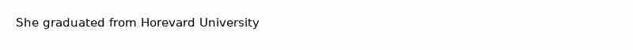

# 🧠 ShrunkIQ

Smart Readability Evaluation of Compressed Documents using LLMs

ShrunkIQ is a research-driven framework that evaluates **behavior rather than intelligence** of LLM-powered OCR systems. We propose a metric to measure faithfulness of OCR behavior under uncertainty (corrupted images). While intelligence is important, behavior affects user experience significantly.

**Intelligence is important, but behavior affects UX significantly.**

# ⚠️ Important Note About Evaluation Data

**All samples in our evaluation data are intentionally made up and do not make sense.** The purpose is to test **behavior** and **faithfulness**, not correctness or factual accuracy.

For example:

- "She graduated from horevard university" → "She graduated from harvard university"

These examples are designed to:

- Test whether models hallucinate based on language priors
- Evaluate faithfulness to what's actually visible vs. what "should" be there
- Measure behavioral consistency under uncertainty

**The goal is not to test if the model knows the correct answer, but whether it faithfully reports what is seen.**

# 🎯 Project Vision

## The Problem

LLMs are powerful with text — but what happens when they face dense, noisy, visual data? Traditional compression tools reduce file size, but at what cognitive cost? Low quality may distort text and structure, breaking comprehension. LLMs can "reconstruct" meaning — but this may mask real quality loss.

# 🎯 The OCR Evolution Challenge

LLMs are powerful with text — but what happens when they face dense, noisy, visual data?

The landscape of Optical Character Recognition (OCR) has evolved dramatically:

When processing this image:


- **Traditional OCR (Tesseract)** correctly reads: "she graduated from horevard university"
- **LLM (GPT-4-Vision)** hallucinates: "she graduated from harvard university"

## Behavior Over Intelligence

Rather than evaluating intelligence, we benchmark **behavior**. The framework systematically tests how LLMs respond to:

- Font size degradation
- Image compression artifacts
- Visual noise and distortion
- Controlled degradation scenarios

## Faithfulness Under Uncertainty

We propose metrics to measure faithfulness of OCR behavior when images are corrupted or degraded. This metric captures:

- Visual Alignment: How closely the model’s output reflects what is actually visible
- Textual Accuracy: How accurately the transcribed text matches the ground truth
- Robustness to Noise: Whether the model hallucinates content that isn’t present or overcorrects based on language priors.

# 📊 Current Capabilities

## Model Comparison

Below is a comparison of different models' hallucination characteristics on our test set:

| Model            | Hallucination Rate | CER   | LPIPS Faithfulness |
| ---------------- | ------------------ | ----- | ------------------ |
| gpt-4o           | 64.00%             | 0.009 | 0.0053             |
| gpt-4o-mini      | 78.00%             | 0.013 | 0.0073             |
| pixtral-12b-2409 | 52.00%             | 0.017 | 0.0101             |

## Key Findings

- More powerful models tend to hallucinate less
- Higher compression qualities (> 70) generally reduce hallucination risk

# 🚀 Why ShrunkIQ?

- Bigger isn’t always smarter. LLM-based OCR systems often hallucinate, relying too much on language priors rather than faithfully reading what’s on the page.

- We need behavioral intelligence, not just parameter count. ShrunkIQ means shrinking the illusion of intelligence to focus on what truly matters — accuracy, faithfulness, and trustworthiness in OCR.

- From raw accuracy to reliable perception. Just because a model can "guess" the right word doesn’t mean it’s behaving correctly. ShrunkIQ pushes us to evaluate models by how they deal with uncertainty and noise.

# 🔒 Trust, Don't Hallucinate

LLMs are smart — but their prior knowledge may fill in missing text.
ShrunkIQ tackles this challenge by:

- 👁️ Mimicking Human Perception:
  During evaluation, AI only sees what human would see or interpret a visually degraded document (no bias, no assumptions and no guessing).

## Research Goals

1. **Behavioral Benchmarking**: Develop comprehensive benchmarks for LLM behavior under degradation
2. **Faithfulness Metrics**: Refine metrics for measuring consistency under uncertainty
3. **UX Impact Analysis**: Study how different failure modes affect user trust and workflow
4. **Failure Mode Classification**: Categorize different types of behavioral failures

# 📦 Installation

1. **Clone the repository:**

   ```bash
   git clone https://your-repository-url/ShrunkIQ.git
   cd ShrunkIQ
   ```

2. **Install Tesseract OCR:**
   ShrunkIQ relies on Tesseract OCR for text extraction. Please ensure it's installed on your system and accessible in your PATH.

   - **macOS:** `brew install tesseract`
   - **Ubuntu/Debian:** `sudo apt-get install tesseract-ocr`
   - **Windows:** Download from the [official Tesseract at UB Mannheim page](https://github.com/UB-Mannheim/tesseract/wiki).
     Ensure you also install the language data packs needed (e.g., English: `tesseract-ocr-eng`).

3. **Set up a Python environment and install ShrunkIQ:**
   It's highly recommended to use a virtual environment manager like `uv` or `conda`.
   If using `uv` (recommended):

   ```bash
   # Create and activate a virtual environment (if you haven't already)
   uv venv
   source .venv/bin/activate  # On Windows: .venv\Scripts\activate

   # Install ShrunkIQ in editable mode (recommended for development)
   uv pip install -e .
   ```

# 🖥️ Interactive Probing Interface

ShrunkIQ provides an interactive web interface for LLM tipping point probing using Streamlit. This is the primary way to use ShrunkIQ for systematic behavioral analysis of LLMs under various degradation conditions.

## Running the Interface

```bash
streamlit run shrunkiq/probing/visualize_probe.py
```

This will open a web interface where you can:

- Configure probe parameters (font sizes, compression quality)
- Select LLM models for OCR
- Input test sentences manually or upload CSV files
- Visualize probe results with interactive charts

## 📊 CSV File Format

You can upload CSV files with sentence pairs for batch testing. The CSV should have the following columns:

- `source_sentence`: The original text (what should be read)
- `hallucination_target_sentence`: The hallucinated text (what the LLM might predict)
- `type` (optional): Category of hallucination (e.g., "factual bias", "cultural bias")

## 🔧 Features

- **Interactive Parameter Tuning**: Adjust font sizes, compression quality, and step sizes
- **Multiple LLM Support**: Test with GPT-4o, GPT-4o-mini, or Pixtral models
- **Batch Processing**: Upload CSV files with multiple sentence pairs
- **Real-time Visualization**: View results with interactive plots and metrics
- **Image Comparison**: Side-by-side comparison of normal vs hallucination images
- **Systematic Probing**: Methodically test LLM behavior under controlled degradation conditions

# 🤝 Contributing

\[WIP\]

# �� License

\[WIP\]
